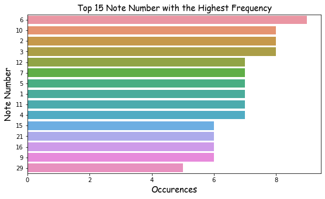
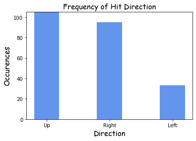
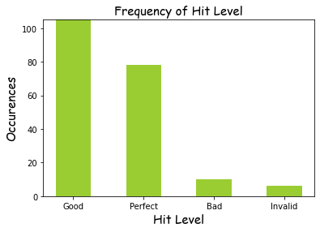

```python
import json
record = []
for line in open('20220626', 'r'):
    record.append(json.loads(line))
```


```python
hit_level_list=[]
Note_Number_list=[]
MusicScene_Direction_list=[]
for i in range(len(record)):
    if record[i]['name']=='Note Hit':
        custom_parameters=record[i]['custom_params']
        custom_parameters.items()
        list_total = list(custom_parameters.items())
        list_key =list(custom_parameters.keys())
        list_value=list(custom_parameters.values())
#         print(list_value)
        hit_level_list.append(list_value[0])
        Note_Number_list.append(list_value[1])
        for i in list_value:
            if i=='Never_Gonna_Give_You_Up.mid':
                MusicScene_Direction_list.append(list_value[1:4])

# MusicScene_Direction_list
```


```python
# create a combined dataframe with a list of Note Number, MusicScene, and Direction.
import pandas as pd
df = pd.DataFrame (MusicScene_Direction_list, columns = ['Note Number', 'MusicScene','Direction'])
# print (df)
```


```python
# create a combined dataframe with a list of Hit Level and Note Number.
import pandas as pd

zipped = list(zip(hit_level_list,Note_Number_list))
df_2 = pd.DataFrame(zipped, columns=['Hit Level', 'Note Number'])
with pd.option_context('display.max_rows', None,
                       'display.max_columns', None,
                       'display.precision', 3,
                       ):
    print(df_2)
    
```

        Hit Level Note Number
    0     Perfect          22
    1     Perfect           1
    2     Invalid          32
    3        Good          37
    4        Good          12
    5        Good          56
    6        Good          13
    7        Good          62
    8     Perfect          47
    9        Good          16
    10        Bad          25
    11       Good          18
    12       Good          52
    13       Good           1
    14    Perfect          36
    15    Perfect          17
    16    Perfect          17
    17       Good          44
    18       Good           8
    19       Good          41
    20       Good          26
    21    Perfect          32
    22       Good           6
    23       Good          21
    24    Perfect          18
    25    Perfect          17
    26       Good          39
    27       Good          58
    28    Perfect           5
    29    Perfect           9
    30    Perfect          25
    31       Good           5
    32       Good           5
    33       Good           3
    34    Invalid          15
    35    Perfect          43
    36    Perfect          33
    37    Perfect          55
    38    Perfect           1
    39       Good          32
    40       Good          12
    41       Good          10
    42    Perfect          20
    43       Good          23
    44       Good          41
    45    Perfect          11
    46       Good          24
    47    Perfect          46
    48       Good          15
    49       Good           4
    50       Good           4
    51       Good           8
    52       Good           3
    53       Good          54
    54    Perfect          12
    55    Invalid          16
    56    Invalid          21
    57    Perfect          31
    58        Bad          57
    59       Good           2
    60       Good           1
    61       Good          43
    62       Good          14
    63    Perfect          11
    64       Good          33
    65        Bad          27
    66       Good           6
    67       Good          13
    68       Good          12
    69       Good          20
    70       Good           8
    71       Good          10
    72       Good           4
    73       Good          37
    74    Perfect          13
    75       Good           8
    76    Perfect          44
    77    Perfect          49
    78    Perfect           6
    79    Invalid           3
    80       Good           7
    81    Perfect          26
    82       Good          12
    83       Good           1
    84        Bad          39
    85    Perfect          28
    86       Good          43
    87       Good          10
    88       Good           9
    89       Good          15
    90       Good           7
    91    Perfect          23
    92       Good          13
    93       Good          27
    94       Good           2
    95        Bad           6
    96    Perfect          11
    97       Good           9
    98    Perfect          42
    99    Perfect          35
    100      Good          22
    101      Good          26
    102      Good          25
    103      Good           7
    104   Perfect          27
    105      Good          45
    106      Good          23
    107      Good          21
    108      Good           9
    109      Good          48
    110      Good          10
    111   Perfect          21
    112      Good           1
    113   Perfect          41
    114      Good          15
    115      Good           6
    116      Good          16
    117      Good           4
    118      Good          15
    119   Perfect          23
    120      Good          29
    121      Good          12
    122      Good          24
    123       Bad           9
    124      Good           2
    125      Good          30
    126      Good          34
    127   Perfect          30
    128      Good          19
    129      Good          27
    130      Good          49
    131   Perfect           2
    132      Good          13
    133      Good          31
    134   Perfect          29
    135   Perfect          32
    136   Perfect           7
    137   Perfect          16
    138      Good           3
    139      Good           2
    140      Good          10
    141      Good          22
    142      Good          20
    143       Bad          24
    144      Good          28
    145   Perfect          17
    146       Bad          10
    147      Good          29
    148      Good          48
    149      Good           8
    150   Perfect          16
    151      Good          20
    152   Perfect          48
    153   Perfect          45
    154      Good          22
    155      Good          27
    156   Perfect          38
    157   Perfect          21
    158      Good          10
    159      Good           4
    160      Good           6
    161      Good           0
    162      Good          31
    163      Good           7
    164   Perfect          31
    165   Perfect          19
    166   Perfect          30
    167      Good          11
    168      Good          33
    169   Perfect          32
    170      Good           5
    171      Good          18
    172      Good          14
    173   Perfect          45
    174      Good          14
    175       Bad          26
    176       Bad          21
    177      Good           0
    178      Good          11
    179   Perfect          23
    180      Good          38
    181   Perfect          25
    182   Perfect           9
    183      Good           6
    184      Good          29
    185      Good          50
    186      Good           5
    187      Good          17
    188      Good           3
    189   Perfect          47
    190      Good          38
    191   Perfect          39
    192   Perfect          19
    193      Good          51
    194   Perfect          30
    195      Good          10
    196   Perfect          29
    197      Good           6
    198      Good          46
    199      Good           3
    200      Good          42
    201   Perfect           3
    202   Perfect          14
    203      Good           1
    204      Good          19
    205   Perfect          16
    206   Perfect          37
    207      Good          40
    208      Good           3
    209   Perfect          20
    210      Good          25
    211   Invalid           6
    212      Good           4
    213   Perfect           2
    214      Good          28
    215      Good          53
    216      Good           4
    217   Perfect          31
    218   Perfect          34
    219   Perfect           5
    220       Bad          47
    221      Good           5
    222   Perfect          14
    223   Perfect          40
    224      Good           2
    225      Good          22
    226   Perfect          24
    227      Good          28
    228      Good           7
    229      Good           7
    230      Good          40
    231   Perfect          11
    232   Perfect          18
    233   Perfect           2
    234      Good          11
    235      Good          18
    236      Good          36
    237      Good          24
    238      Good          19
    239      Good          44
    240   Perfect          12
    241   Perfect          15
    242   Perfect          49


```python
#Merge Two Dataframe into One
result = pd.merge(df_2,
                 df[['Note Number', 'MusicScene','Direction']],
                 on='Note Number')
with pd.option_context('display.max_rows', None,
                       'display.max_columns', None,
                       'display.precision', 3,
                       ):
    print(result)
```

        Hit Level Note Number                   MusicScene Direction
    0     Perfect          22  Never_Gonna_Give_You_Up.mid     Right
    1        Good          22  Never_Gonna_Give_You_Up.mid     Right
    2        Good          22  Never_Gonna_Give_You_Up.mid     Right
    3        Good          22  Never_Gonna_Give_You_Up.mid     Right
    4        Good          22  Never_Gonna_Give_You_Up.mid     Right
    5     Perfect           1  Never_Gonna_Give_You_Up.mid        Up
    6        Good           1  Never_Gonna_Give_You_Up.mid        Up
    7     Perfect           1  Never_Gonna_Give_You_Up.mid        Up
    8        Good           1  Never_Gonna_Give_You_Up.mid        Up
    9        Good           1  Never_Gonna_Give_You_Up.mid        Up
    10       Good           1  Never_Gonna_Give_You_Up.mid        Up
    11       Good           1  Never_Gonna_Give_You_Up.mid        Up
    12    Invalid          32  Never_Gonna_Give_You_Up.mid     Right
    13    Perfect          32  Never_Gonna_Give_You_Up.mid     Right
    14       Good          32  Never_Gonna_Give_You_Up.mid     Right
    15    Perfect          32  Never_Gonna_Give_You_Up.mid     Right
    16    Perfect          32  Never_Gonna_Give_You_Up.mid     Right
    17       Good          37  Never_Gonna_Give_You_Up.mid     Right
    18       Good          37  Never_Gonna_Give_You_Up.mid     Right
    19    Perfect          37  Never_Gonna_Give_You_Up.mid     Right
    20       Good          12  Never_Gonna_Give_You_Up.mid      Left
    21       Good          12  Never_Gonna_Give_You_Up.mid      Left
    22    Perfect          12  Never_Gonna_Give_You_Up.mid      Left
    23       Good          12  Never_Gonna_Give_You_Up.mid      Left
    24       Good          12  Never_Gonna_Give_You_Up.mid      Left
    25       Good          12  Never_Gonna_Give_You_Up.mid      Left
    26    Perfect          12  Never_Gonna_Give_You_Up.mid      Left
    27       Good          13  Never_Gonna_Give_You_Up.mid      Left
    28       Good          13  Never_Gonna_Give_You_Up.mid      Left
    29    Perfect          13  Never_Gonna_Give_You_Up.mid      Left
    30       Good          13  Never_Gonna_Give_You_Up.mid      Left
    31       Good          13  Never_Gonna_Give_You_Up.mid      Left
    32    Perfect          47  Never_Gonna_Give_You_Up.mid        Up
    33    Perfect          47  Never_Gonna_Give_You_Up.mid        Up
    34        Bad          47  Never_Gonna_Give_You_Up.mid        Up
    35       Good          16  Never_Gonna_Give_You_Up.mid     Right
    36    Invalid          16  Never_Gonna_Give_You_Up.mid     Right
    37       Good          16  Never_Gonna_Give_You_Up.mid     Right
    38    Perfect          16  Never_Gonna_Give_You_Up.mid     Right
    39    Perfect          16  Never_Gonna_Give_You_Up.mid     Right
    40    Perfect          16  Never_Gonna_Give_You_Up.mid     Right
    41        Bad          25  Never_Gonna_Give_You_Up.mid     Right
    42    Perfect          25  Never_Gonna_Give_You_Up.mid     Right
    43       Good          25  Never_Gonna_Give_You_Up.mid     Right
    44    Perfect          25  Never_Gonna_Give_You_Up.mid     Right
    45       Good          25  Never_Gonna_Give_You_Up.mid     Right
    46       Good          18  Never_Gonna_Give_You_Up.mid     Right
    47    Perfect          18  Never_Gonna_Give_You_Up.mid     Right
    48       Good          18  Never_Gonna_Give_You_Up.mid     Right
    49    Perfect          18  Never_Gonna_Give_You_Up.mid     Right
    50       Good          18  Never_Gonna_Give_You_Up.mid     Right
    51    Perfect          36  Never_Gonna_Give_You_Up.mid     Right
    52       Good          36  Never_Gonna_Give_You_Up.mid     Right
    53    Perfect          17  Never_Gonna_Give_You_Up.mid     Right
    54    Perfect          17  Never_Gonna_Give_You_Up.mid     Right
    55    Perfect          17  Never_Gonna_Give_You_Up.mid     Right
    56    Perfect          17  Never_Gonna_Give_You_Up.mid     Right
    57       Good          17  Never_Gonna_Give_You_Up.mid     Right
    58       Good          44  Never_Gonna_Give_You_Up.mid        Up
    59    Perfect          44  Never_Gonna_Give_You_Up.mid        Up
    60       Good          44  Never_Gonna_Give_You_Up.mid        Up
    61       Good           8  Never_Gonna_Give_You_Up.mid        Up
    62       Good           8  Never_Gonna_Give_You_Up.mid        Up
    63       Good           8  Never_Gonna_Give_You_Up.mid        Up
    64       Good           8  Never_Gonna_Give_You_Up.mid        Up
    65       Good           8  Never_Gonna_Give_You_Up.mid        Up
    66       Good          41  Never_Gonna_Give_You_Up.mid        Up
    67       Good          41  Never_Gonna_Give_You_Up.mid        Up
    68    Perfect          41  Never_Gonna_Give_You_Up.mid        Up
    69       Good          26  Never_Gonna_Give_You_Up.mid     Right
    70    Perfect          26  Never_Gonna_Give_You_Up.mid     Right
    71       Good          26  Never_Gonna_Give_You_Up.mid     Right
    72        Bad          26  Never_Gonna_Give_You_Up.mid     Right
    73       Good           6  Never_Gonna_Give_You_Up.mid        Up
    74       Good           6  Never_Gonna_Give_You_Up.mid        Up
    75    Perfect           6  Never_Gonna_Give_You_Up.mid        Up
    76        Bad           6  Never_Gonna_Give_You_Up.mid        Up
    77       Good           6  Never_Gonna_Give_You_Up.mid        Up
    78       Good           6  Never_Gonna_Give_You_Up.mid        Up
    79       Good           6  Never_Gonna_Give_You_Up.mid        Up
    80       Good           6  Never_Gonna_Give_You_Up.mid        Up
    81    Invalid           6  Never_Gonna_Give_You_Up.mid        Up
    82       Good          21  Never_Gonna_Give_You_Up.mid     Right
    83    Invalid          21  Never_Gonna_Give_You_Up.mid     Right
    84       Good          21  Never_Gonna_Give_You_Up.mid     Right
    85    Perfect          21  Never_Gonna_Give_You_Up.mid     Right
    86    Perfect          21  Never_Gonna_Give_You_Up.mid     Right
    87        Bad          21  Never_Gonna_Give_You_Up.mid     Right
    88       Good          39  Never_Gonna_Give_You_Up.mid        Up
    89        Bad          39  Never_Gonna_Give_You_Up.mid        Up
    90    Perfect          39  Never_Gonna_Give_You_Up.mid        Up
    91    Perfect           5  Never_Gonna_Give_You_Up.mid        Up
    92       Good           5  Never_Gonna_Give_You_Up.mid        Up
    93       Good           5  Never_Gonna_Give_You_Up.mid        Up
    94       Good           5  Never_Gonna_Give_You_Up.mid        Up
    95       Good           5  Never_Gonna_Give_You_Up.mid        Up
    96    Perfect           5  Never_Gonna_Give_You_Up.mid        Up
    97       Good           5  Never_Gonna_Give_You_Up.mid        Up
    98    Perfect           9  Never_Gonna_Give_You_Up.mid        Up
    99       Good           9  Never_Gonna_Give_You_Up.mid        Up
    100      Good           9  Never_Gonna_Give_You_Up.mid        Up
    101      Good           9  Never_Gonna_Give_You_Up.mid        Up
    102       Bad           9  Never_Gonna_Give_You_Up.mid        Up
    103   Perfect           9  Never_Gonna_Give_You_Up.mid        Up
    104      Good           3  Never_Gonna_Give_You_Up.mid        Up
    105      Good           3  Never_Gonna_Give_You_Up.mid        Up
    106   Invalid           3  Never_Gonna_Give_You_Up.mid        Up
    107      Good           3  Never_Gonna_Give_You_Up.mid        Up
    108      Good           3  Never_Gonna_Give_You_Up.mid        Up
    109      Good           3  Never_Gonna_Give_You_Up.mid        Up
    110   Perfect           3  Never_Gonna_Give_You_Up.mid        Up
    111      Good           3  Never_Gonna_Give_You_Up.mid        Up
    112   Invalid          15  Never_Gonna_Give_You_Up.mid     Right
    113      Good          15  Never_Gonna_Give_You_Up.mid     Right
    114      Good          15  Never_Gonna_Give_You_Up.mid     Right
    115      Good          15  Never_Gonna_Give_You_Up.mid     Right
    116      Good          15  Never_Gonna_Give_You_Up.mid     Right
    117   Perfect          15  Never_Gonna_Give_You_Up.mid     Right
    118   Perfect          43  Never_Gonna_Give_You_Up.mid        Up
    119      Good          43  Never_Gonna_Give_You_Up.mid        Up
    120      Good          43  Never_Gonna_Give_You_Up.mid        Up
    121   Perfect          33  Never_Gonna_Give_You_Up.mid     Right
    122      Good          33  Never_Gonna_Give_You_Up.mid     Right
    123      Good          33  Never_Gonna_Give_You_Up.mid     Right
    124      Good          10  Never_Gonna_Give_You_Up.mid        Up
    125      Good          10  Never_Gonna_Give_You_Up.mid        Up
    126      Good          10  Never_Gonna_Give_You_Up.mid        Up
    127      Good          10  Never_Gonna_Give_You_Up.mid        Up
    128      Good          10  Never_Gonna_Give_You_Up.mid        Up
    129       Bad          10  Never_Gonna_Give_You_Up.mid        Up
    130      Good          10  Never_Gonna_Give_You_Up.mid        Up
    131      Good          10  Never_Gonna_Give_You_Up.mid        Up
    132   Perfect          20  Never_Gonna_Give_You_Up.mid     Right
    133      Good          20  Never_Gonna_Give_You_Up.mid     Right
    134      Good          20  Never_Gonna_Give_You_Up.mid     Right
    135      Good          20  Never_Gonna_Give_You_Up.mid     Right
    136   Perfect          20  Never_Gonna_Give_You_Up.mid     Right
    137      Good          23  Never_Gonna_Give_You_Up.mid     Right
    138   Perfect          23  Never_Gonna_Give_You_Up.mid     Right
    139      Good          23  Never_Gonna_Give_You_Up.mid     Right
    140   Perfect          23  Never_Gonna_Give_You_Up.mid     Right
    141   Perfect          23  Never_Gonna_Give_You_Up.mid     Right
    142   Perfect          11  Never_Gonna_Give_You_Up.mid      Left
    143   Perfect          11  Never_Gonna_Give_You_Up.mid      Left
    144   Perfect          11  Never_Gonna_Give_You_Up.mid      Left
    145      Good          11  Never_Gonna_Give_You_Up.mid      Left
    146      Good          11  Never_Gonna_Give_You_Up.mid      Left
    147   Perfect          11  Never_Gonna_Give_You_Up.mid      Left
    148      Good          11  Never_Gonna_Give_You_Up.mid      Left
    149      Good          24  Never_Gonna_Give_You_Up.mid     Right
    150      Good          24  Never_Gonna_Give_You_Up.mid     Right
    151       Bad          24  Never_Gonna_Give_You_Up.mid     Right
    152   Perfect          24  Never_Gonna_Give_You_Up.mid     Right
    153      Good          24  Never_Gonna_Give_You_Up.mid     Right
    154   Perfect          46  Never_Gonna_Give_You_Up.mid        Up
    155      Good          46  Never_Gonna_Give_You_Up.mid        Up
    156      Good           4  Never_Gonna_Give_You_Up.mid        Up
    157      Good           4  Never_Gonna_Give_You_Up.mid        Up
    158      Good           4  Never_Gonna_Give_You_Up.mid        Up
    159      Good           4  Never_Gonna_Give_You_Up.mid        Up
    160      Good           4  Never_Gonna_Give_You_Up.mid        Up
    161      Good           4  Never_Gonna_Give_You_Up.mid        Up
    162      Good           4  Never_Gonna_Give_You_Up.mid        Up
    163   Perfect          31  Never_Gonna_Give_You_Up.mid     Right
    164      Good          31  Never_Gonna_Give_You_Up.mid     Right
    165      Good          31  Never_Gonna_Give_You_Up.mid     Right
    166   Perfect          31  Never_Gonna_Give_You_Up.mid     Right
    167   Perfect          31  Never_Gonna_Give_You_Up.mid     Right
    168      Good           2  Never_Gonna_Give_You_Up.mid        Up
    169      Good           2  Never_Gonna_Give_You_Up.mid        Up
    170      Good           2  Never_Gonna_Give_You_Up.mid        Up
    171   Perfect           2  Never_Gonna_Give_You_Up.mid        Up
    172      Good           2  Never_Gonna_Give_You_Up.mid        Up
    173   Perfect           2  Never_Gonna_Give_You_Up.mid        Up
    174      Good           2  Never_Gonna_Give_You_Up.mid        Up
    175   Perfect           2  Never_Gonna_Give_You_Up.mid        Up
    176      Good          14  Never_Gonna_Give_You_Up.mid     Right
    177      Good          14  Never_Gonna_Give_You_Up.mid     Right
    178      Good          14  Never_Gonna_Give_You_Up.mid     Right
    179   Perfect          14  Never_Gonna_Give_You_Up.mid     Right
    180   Perfect          14  Never_Gonna_Give_You_Up.mid     Right
    181       Bad          27  Never_Gonna_Give_You_Up.mid      Left
    182      Good          27  Never_Gonna_Give_You_Up.mid      Left
    183   Perfect          27  Never_Gonna_Give_You_Up.mid      Left
    184      Good          27  Never_Gonna_Give_You_Up.mid      Left
    185      Good          27  Never_Gonna_Give_You_Up.mid      Left
    186   Perfect          49  Never_Gonna_Give_You_Up.mid        Up
    187      Good          49  Never_Gonna_Give_You_Up.mid        Up
    188   Perfect          49  Never_Gonna_Give_You_Up.mid        Up
    189      Good           7  Never_Gonna_Give_You_Up.mid        Up
    190      Good           7  Never_Gonna_Give_You_Up.mid        Up
    191      Good           7  Never_Gonna_Give_You_Up.mid        Up
    192   Perfect           7  Never_Gonna_Give_You_Up.mid        Up
    193      Good           7  Never_Gonna_Give_You_Up.mid        Up
    194      Good           7  Never_Gonna_Give_You_Up.mid        Up
    195      Good           7  Never_Gonna_Give_You_Up.mid        Up
    196   Perfect          28  Never_Gonna_Give_You_Up.mid      Left
    197      Good          28  Never_Gonna_Give_You_Up.mid      Left
    198      Good          28  Never_Gonna_Give_You_Up.mid      Left
    199      Good          28  Never_Gonna_Give_You_Up.mid      Left
    200   Perfect          42  Never_Gonna_Give_You_Up.mid        Up
    201      Good          42  Never_Gonna_Give_You_Up.mid        Up
    202   Perfect          35  Never_Gonna_Give_You_Up.mid     Right
    203      Good          45  Never_Gonna_Give_You_Up.mid        Up
    204   Perfect          45  Never_Gonna_Give_You_Up.mid        Up
    205   Perfect          45  Never_Gonna_Give_You_Up.mid        Up
    206      Good          48  Never_Gonna_Give_You_Up.mid        Up
    207      Good          48  Never_Gonna_Give_You_Up.mid        Up
    208   Perfect          48  Never_Gonna_Give_You_Up.mid        Up
    209      Good          29  Never_Gonna_Give_You_Up.mid      Left
    210   Perfect          29  Never_Gonna_Give_You_Up.mid      Left
    211      Good          29  Never_Gonna_Give_You_Up.mid      Left
    212      Good          29  Never_Gonna_Give_You_Up.mid      Left
    213   Perfect          29  Never_Gonna_Give_You_Up.mid      Left
    214      Good          30  Never_Gonna_Give_You_Up.mid     Right
    215   Perfect          30  Never_Gonna_Give_You_Up.mid     Right
    216   Perfect          30  Never_Gonna_Give_You_Up.mid     Right
    217   Perfect          30  Never_Gonna_Give_You_Up.mid     Right
    218      Good          34  Never_Gonna_Give_You_Up.mid     Right
    219   Perfect          34  Never_Gonna_Give_You_Up.mid     Right
    220      Good          19  Never_Gonna_Give_You_Up.mid     Right
    221   Perfect          19  Never_Gonna_Give_You_Up.mid     Right
    222   Perfect          19  Never_Gonna_Give_You_Up.mid     Right
    223      Good          19  Never_Gonna_Give_You_Up.mid     Right
    224      Good          19  Never_Gonna_Give_You_Up.mid     Right
    225   Perfect          38  Never_Gonna_Give_You_Up.mid     Right
    226      Good          38  Never_Gonna_Give_You_Up.mid     Right
    227      Good          38  Never_Gonna_Give_You_Up.mid     Right
    228      Good           0  Never_Gonna_Give_You_Up.mid        Up
    229      Good           0  Never_Gonna_Give_You_Up.mid        Up
    230      Good          40  Never_Gonna_Give_You_Up.mid        Up
    231   Perfect          40  Never_Gonna_Give_You_Up.mid        Up
    232      Good          40  Never_Gonna_Give_You_Up.mid        Up


```python
Hit_Level_Frequency = result['Hit Level'].value_counts()
print(Hit_Level_Frequency)
```

    Good       139
    Perfect     78
    Bad         10
    Invalid      6
    Name: Hit Level, dtype: int64


```python
Note_Number_Frequency = result['Note Number'].value_counts()
print(Note_Number_Frequency)
Max_Note_Number = Note_Number_Frequency.max()
Min_Note_Number=Note_Number_Frequency.min()
print(Max_Note_Number)
print(Min_Note_Number)
```

    6     9
    10    8
    2     8
    3     8
    12    7
    7     7
    5     7
    1     7
    11    7
    4     7
    15    6
    21    6
    16    6
    9     6
    29    5
    31    5
    24    5
    14    5
    23    5
    20    5
    19    5
    27    5
    22    5
    13    5
    32    5
    8     5
    17    5
    18    5
    25    5
    26    4
    30    4
    28    4
    43    3
    38    3
    37    3
    48    3
    45    3
    49    3
    33    3
    47    3
    44    3
    41    3
    39    3
    40    3
    42    2
    36    2
    46    2
    34    2
    0     2
    35    1
    Name: Note Number, dtype: int64
    9
    1


```python
import numpy as np
import matplotlib.pyplot as plt
import seaborn as sns

_order = Note_Number_Frequency.head(15).index
plt.figure(figsize=(9, 5))
sns.countplot(data=result, y='Note Number', order=_order)
plt.title('Top 15 Note Number with the Highest Frequency', fontsize=14.5, fontname='Comic Sans MS')
plt.xlabel('Occurences', fontsize=14.5,fontname='Comic Sans MS')
plt.ylabel('Note Number', fontsize=14.5,fontname='Comic Sans MS');
```


    

    


```python
Direction_Frequency= result['Direction'].value_counts()
print(Direction_Frequency)
Max_Direction_Frequency = Direction_Frequency.max()
Min_Direction_Frequency = Direction_Frequency.min()
print(f'The most frequent applied direction is {Max_Direction_Frequency}')
print(f'The least frequent applied direction is {Min_Direction_Frequency}')

```

    Up       105
    Right     95
    Left      33
    Name: Direction, dtype: int64
    The most frequent applied direction is 105
    The least frequent applied direction is 33


```python
import numpy as np
import matplotlib.pyplot as plt
# #visualization: Plot a dataframe to a bar plot.

# create dataset
Direction_= [105, 95, 33]
bars = ('Up', 'Right', 'Left')
x_pos = np.arange(len(bars))
 
# Create bars and choose color
plt.bar(x_pos,width=0.4,height=Direction_, color = 'cornflowerblue')
 
# Add title and axis names
plt.title('Frequency of Hit Direction', fontsize=15, fontname='Comic Sans MS')
plt.xlabel('Direction', fontsize=15,fontname='Comic Sans MS')
plt.ylabel('Occurences', fontsize=15,fontname='Comic Sans MS')


# Create names on the x axis
plt.xticks(x_pos, bars)

plt.ylim(top = max(Direction_))
# Show graph
plt.show()
```


    

    


```python
import numpy as np
import matplotlib.pyplot as plt

# create dataset
Hit_Level_= [139, 78, 10, 6]
bars = ('Good', 'Perfect', 'Bad','Invalid')
x_pos = np.arange(len(bars))
 
# Create bars and choose color
plt.bar(x_pos,width=0.5,height=Hit_Level_, color = 'yellowgreen')
 
# Add title and axis names
plt.title('Frequency of Hit Level', fontsize=15, fontname='Comic Sans MS')
plt.xlabel('Hit Level', fontsize=15,fontname='Comic Sans MS')
plt.ylabel('Occurences', fontsize=15,fontname='Comic Sans MS')


# Create names on the x axis
plt.xticks(x_pos, bars)

plt.ylim(top = max(Direction_))
# Show graph
plt.show()
 
```


    

    

